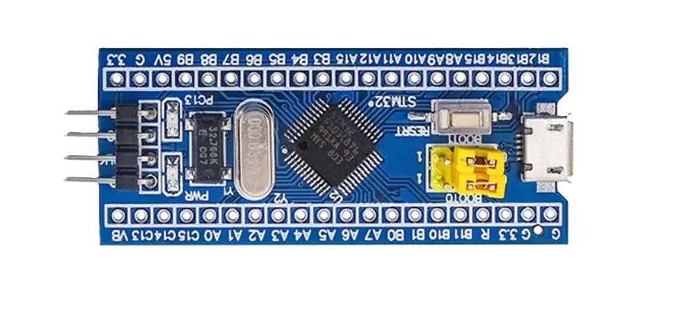

# STM32F103 BluePill Development Board

## Overview
This repository contains basic function testing code for the STM32F103C8T6 BluePill development board. The BluePill is a popular and affordable development board based on the ARM Cortex-M3 microcontroller.

## Features
- Basic GPIO operations
- Peripheral initialization examples
- Simple test routines
- Easy-to-understand code structure

## Getting Started
1. Clone this repository
2. Open the project in your preferred IDE (e.g., STM32CubeIDE, Keil, etc.)
3. Build and flash the program to your BluePill board

## Project Structure
- `src/` - Source code files
- `inc/` - Header files
- `docs/` - Documentation and resources

## Requirements
- STM32F103C8T6 BluePill board
- ST-Link programmer (or compatible)
- Development environment (STM32CubeIDE, Keil, etc.)

## License
This project is open source and available under the MIT License.
